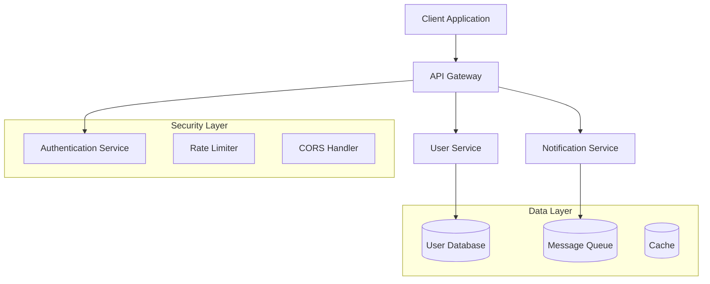
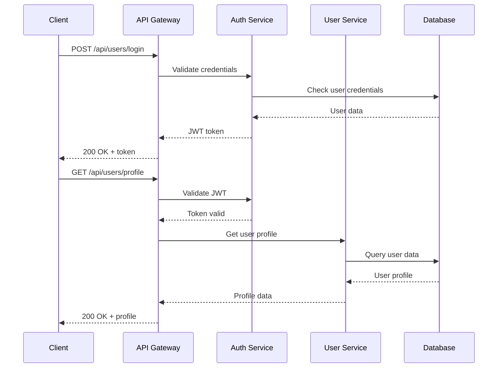

# Documentation Standards Instructions

**Keywords**: #documentation #in-code-docs #api-docs #diagrams #standards

---

## 📝 Documentation Rule Directives

### In-Code Documentation Standards

```
@documentation Rule - Document Purpose: Every function, class, and module must have clear documentation explaining its purpose and responsibility.
```

```
@documentation Rule - Parameter Documentation: Document all parameters including their types, expected values, and constraints.
```

```
@documentation Rule - Return Value Documentation: Document return values including types, possible values, and error conditions.
```

```
@documentation Rule - Exception Documentation: Document all exceptions that can be thrown, including when and why they occur.
```

```
@documentation Rule - Code Examples: Include practical examples for complex functions, APIs, and usage patterns.
```

```
@documentation Rule - Consistent Style: Follow language-specific documentation standards (JSDoc, Google docstrings, XML docs, etc.).
```

### API Documentation

```
@documentation Rule - API Endpoints: Document all API endpoints with request/response examples, status codes, and error conditions.
```

```
@documentation Rule - Schema Documentation: Provide comprehensive schema documentation for all data models and DTOs.
```

```
@documentation Rule - Authentication Docs: Document authentication mechanisms, token formats, and security requirements.
```

```
@documentation Rule - Rate Limiting Docs: Document rate limits, quotas, and throttling policies.
```

### Architecture Documentation

```
@documentation Rule - System Architecture: Maintain up-to-date architecture diagrams showing system components and interactions.
```

```
@documentation Rule - Database Schema: Document database schemas, relationships, and constraints.
```

```
@documentation Rule - Deployment Architecture: Document deployment topology, environments, and infrastructure requirements.
```

```
@documentation Rule - Security Architecture: Document security controls, authentication flows, and authorization mechanisms.
```

## 🎯 Language-Specific Documentation Standards

### Python Documentation (Google Style)

```python
def calculate_user_score(user_id: int, weights: Dict[str, float], 
                        normalize: bool = True) -> Tuple[float, Dict[str, Any]]:
    """Calculate user score based on multiple factors.
    
    This function computes a weighted score for a user based on various
    metrics like engagement, activity, and performance indicators.
    
    Args:
        user_id: The unique identifier for the user.
        weights: Dictionary mapping metric names to their weights.
            Must contain keys: 'engagement', 'activity', 'performance'.
        normalize: Whether to normalize the final score to 0-1 range.
            Defaults to True.
    
    Returns:
        A tuple containing:
            - The calculated score as a float
            - A dictionary with detailed metrics breakdown
    
    Raises:
        ValueError: If user_id is not found or weights are invalid.
        DatabaseError: If database connection fails.
    
    Example:
        >>> weights = {'engagement': 0.4, 'activity': 0.3, 'performance': 0.3}
        >>> score, details = calculate_user_score(123, weights)
        >>> print(f"User score: {score:.2f}")
        User score: 0.85
    
    Note:
        This function requires database access and may be slow for
        large datasets. Consider using batch processing for multiple users.
    """
```

### C# Documentation (XML Documentation)

```csharp
/// <summary>
/// Calculates the user score based on multiple weighted factors.
/// </summary>
/// <param name="userId">The unique identifier for the user.</param>
/// <param name="weights">Dictionary mapping metric names to their weights.</param>
/// <param name="normalize">Whether to normalize the final score to 0-1 range.</param>
/// <returns>
/// A <see cref="UserScoreResult"/> containing the calculated score and detailed metrics.
/// </returns>
/// <exception cref="ArgumentException">
/// Thrown when <paramref name="userId"/> is invalid or <paramref name="weights"/> contains invalid values.
/// </exception>
/// <exception cref="DatabaseException">
/// Thrown when database connection fails or data is unavailable.
/// </exception>
/// <example>
/// <code>
/// var weights = new Dictionary&lt;string, float&gt;
/// {
///     ["engagement"] = 0.4f,
///     ["activity"] = 0.3f,
///     ["performance"] = 0.3f
/// };
/// 
/// var result = await CalculateUserScoreAsync(123, weights);
/// Console.WriteLine($"User score: {result.Score:F2}");
/// </code>
/// </example>
/// <remarks>
/// This method requires database access and may be slow for large datasets.
/// Consider using batch processing for multiple users.
/// </remarks>
public async Task<UserScoreResult> CalculateUserScoreAsync(
    int userId, 
    Dictionary<string, float> weights, 
    bool normalize = true)
```

### TypeScript Documentation (TSDoc)

```typescript
/**
 * Calculates the user score based on multiple weighted factors.
 * 
 * @param userId - The unique identifier for the user
 * @param weights - Object mapping metric names to their weights
 * @param normalize - Whether to normalize the final score to 0-1 range
 * @returns Promise resolving to user score result with detailed metrics
 * 
 * @throws {@link ValidationError}
 * Thrown when userId is invalid or weights contain invalid values
 * 
 * @throws {@link DatabaseError}
 * Thrown when database connection fails or data is unavailable
 * 
 * @example
 * ```typescript
 * const weights = {
 *   engagement: 0.4,
 *   activity: 0.3,
 *   performance: 0.3
 * };
 * 
 * const result = await calculateUserScore(123, weights);
 * console.log(`User score: ${result.score.toFixed(2)}`);
 * ```
 * 
 * @remarks
 * This function requires database access and may be slow for large datasets.
 * Consider using batch processing for multiple users.
 */
async function calculateUserScore(
  userId: number,
  weights: Record<string, number>,
  normalize: boolean = true
): Promise<UserScoreResult>
```

## 📊 Diagram Generation Standards

### Architecture Diagrams (Mermaid)

```
@documentation Rule - System Diagrams: Use Mermaid or PlantUML for system architecture diagrams in documentation.
```

```
@documentation Rule - Flow Diagrams: Create flowcharts for complex business logic and decision trees.
```

```
@documentation Rule - Sequence Diagrams: Document API interactions and service communications with sequence diagrams.
```

```
@documentation Rule - Database Diagrams: Use ER diagrams to represent database relationships and constraints.
```

### Example Mermaid Diagrams

#### System Architecture


#### API Flow


## 📖 README Standards

### Project README Template

```markdown
# Project Name

Brief description of what this project does and why it exists.

## 🚀 Features

- Feature 1 with brief description
- Feature 2 with brief description
- Feature 3 with brief description

## 🏗️ Architecture

Brief overview of the system architecture with diagram.

## 🔧 Installation

### Prerequisites
- Requirement 1 (version)
- Requirement 2 (version)

### Setup
1. Clone the repository
2. Install dependencies
3. Configure environment
4. Run the application

## 🔑 Configuration

| Variable | Description | Default | Required |
|----------|-------------|---------|----------|
| VAR_NAME | Description | default | Yes/No |

## 🧪 Testing

How to run tests, coverage requirements, testing strategy.

## 📚 API Documentation

Link to API documentation, key endpoints overview.

## 🔐 Security

Security considerations, authentication, authorization.

## 🚀 Deployment

Deployment instructions, environments, CI/CD.

## 🤝 Contributing

Contribution guidelines, code standards, review process.

## 📄 License

License information.
```

## 📋 Documentation Checklist

### Code Documentation
- [ ] All public APIs documented
- [ ] All parameters and return values documented
- [ ] All exceptions documented
- [ ] Code examples provided for complex functions
- [ ] Documentation follows language conventions

### API Documentation
- [ ] All endpoints documented
- [ ] Request/response schemas defined
- [ ] Authentication requirements specified
- [ ] Error codes and messages documented
- [ ] Rate limiting documented

### Architecture Documentation
- [ ] System architecture diagram created
- [ ] Component interactions documented
- [ ] Data flow diagrams included
- [ ] Database schema documented
- [ ] Security architecture documented

### User Documentation
- [ ] Installation guide created
- [ ] Configuration guide provided
- [ ] User manual written
- [ ] Troubleshooting guide included
- [ ] FAQ section added

---

**Note**: Good documentation is code. Treat it with the same care and attention as your implementation code.
