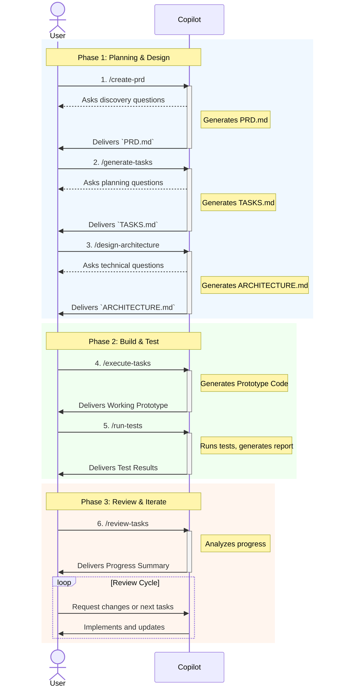

# Using Prompts for Agentic Development

This guide explains how to use prompt files to execute a structured, agentic workflow for rapid solution development, from initial idea to production-ready prototype.

## The Agentic Development Workflow

The agentic development workflow provides a systematic process to transform ideas into functional code. It consists of four main stages, each with a dedicated prompt to guide you.

### Workflow Diagram

Here is the end-to-end process:



---

## How to Run Prompts

You can execute prompts in multiple ways within VS Code.

### Method 1: Command Palette (Recommended)

1.  **Open Command Palette**: `Ctrl+Shift+P` (Windows) or `Cmd+Shift+P` (Mac)
2.  **Type**: "Chat: Run Prompt"
3.  **Select**: Choose your desired prompt file from the list.
4.  **Follow the conversation**: Answer the questions as Copilot guides you through the process.

### Method 2: Chat Interface

You can invoke prompts directly from the Copilot Chat window using the `@workspace` reference.

**Example**:
```
@workspace Follow the create-prd.prompt.md process for my mobile app idea
```

You can also use the `/` command for a more streamlined experience.

**Example**:
```
/create-prd I want to build a task management app for remote teams
```

---

## Workflow Stages in Detail

### Stage 1: Idea Discovery

**Purpose**: Transform a raw idea into a comprehensive Product Requirements Document (PRD) through structured discovery questions.

**Prompt**: `create-prd.prompt.md`

#### Process
1.  **Run the prompt** using one of the methods above.
2.  **Provide your initial idea** (e.g., "A mobile app to help remote teams stay connected").
3.  **Answer discovery questions** covering problem definition, target users, features, and success metrics.

#### Example Use Case: "AI-Powered Recipe Generator"

**1. Initial Idea:**
> `/create-prd I want to create an AI-powered app that generates recipes based on ingredients a user has at home.`

**2. Answering Discovery Questions:**
*   **Problem**: "Users often have random ingredients and don't know what to make, leading to food waste. They need inspiration for meals without going to the store."
*   **Target Users**: "Busy professionals, students, and families who want to cook more at home but lack time for meal planning."
*   **Core Features**: "Ingredient input (text and photo), recipe generation with difficulty levels, dietary preference filters (vegan, gluten-free), and a 'save to favorites' option."
*   **Success Metrics**: "Daily active users, number of recipes generated, and a 20% reduction in user-reported food waste after 3 months."

#### Expected Output
A detailed `PRD.md` file containing:
- Executive Summary
- Problem Statement & Target Users
- Functional and Non-Functional Requirements
- User Stories and Success Metrics
- Risk Assessment

### Stage 2: Development Planning

**Purpose**: Convert the PRD into a detailed development plan, breaking down features into specific, actionable tasks.

**Prompt**: `generate-tasks.prompt.md`

#### Process
1.  **Run the prompt**, referencing your newly created `PRD.md` in the chat context.
2.  **Answer planning questions** about your team, technical preferences, and timeline constraints.

#### Example
> `/generate-tasks Use the PRD.md for the recipe app to create a development plan. We are a team of 2 developers and prefer using Python and React Native.`

#### Expected Output
A `TASKS.md` file containing:
- Feature Breakdown and Task Lists
- Sprint Planning and Timelines
- Dependencies and Risk Analysis

### Stage 3: Solution Architecture (Optional)

**Purpose**: Design the technical architecture, system components, and technology stack based on the requirements and plan.

**Prompt**: `design-architecture.prompt.md`

#### Process
1.  **Run the prompt**, referencing your `PRD.md` and Development Plan `TASKS.md` in the chat context.
2.  **Answer architecture questions** about scale, performance, security, and technology preferences.

#### Example
> `/design-architecture Design the architecture for the recipe app. It needs to support 10,000 users and have real-time recipe generation.`

#### Expected Output
- Architecture documentation (e.g., `ARCHITECTURE.md`).
- System diagrams (text-based).
- Technology and infrastructure recommendations.

### Stage 4: Rapid Prototyping

**Purpose**: Generate a working prototype that follows project standards and demonstrates core functionality.

**Prompt**: `execute-tasks.prompt.md`

#### Process
1.  **Run the prompt** and choose the type of prototype you want to build (e.g., API, UI, CLI). Make sure to reference your `PRD.md`, `TASKS.md` and/or `ARCHITECTURE.md` files in the chat context.
2.  **Follow the specialized prompts** to generate code for core features.

#### Example
> `/execute-tasks Create the API endpoints for the recipe app. I need CRUD operations for Recipes and User Profiles with JWT authentication.`

#### Expected Output
Working source code for your prototype, including:
- Core feature implementation.
- Error handling and security considerations.
- Documentation and tests.

### Stage 5: Execute Tests

**Purpose**: Validate the prototype against requirements by running automated tests and generating coverage reports.

**Prompt**: `run-tests.prompt.md`

#### Process
1.  **Run the prompt**, referencing the codebase and `TASKS.md`.
2.  **Specify the scope of testing** (e.g., unit, integration, end-to-end, or all).
3.  **Review the test results** and coverage report provided by the agent.

#### Example
> `/run-tests Execute all unit tests for the recipe app API and generate a coverage report.`

#### Expected Output
- A test execution summary.
- Detailed report of any failed tests.
- Code coverage statistics.

### Stage 6: Review and Iterate

**Purpose**: Review the project's progress, analyze completed work, and plan the next development cycle or iteration.

**Prompt**: `review-tasks.prompt.md`

#### Process
1.  **Run the prompt**, referencing your `TASKS.md` file.
2.  The agent will analyze the task list to identify completed, remaining, and blocked tasks.
3.  **Use the summary** to plan your next sprint or decide if the MVP is complete.

#### Example
> `/review-tasks Analyze TASKS.md for the recipe app. What is the completion percentage, and what P0 tasks are left?`

#### Expected Output
- A progress summary (e.g., "Progress: 35/47 tasks complete (74%)").
- A list of remaining high-priority tasks.
- A burndown analysis of completed work.
- It also validates the codebase against the instructions and acts as a code-reviewer.

---

## Best Practices

- **Start Simple**: Begin with the core functionality for your idea.
- **Be Thorough**: Provide detailed answers to the prompts for better results.
- **Review Outputs**: Validate each generated document before proceeding to the next stage.
- **Iterate**: Don't hesitate to go back a stage to refine requirements or plans.

---

## Troubleshooting

- **Incomplete Responses**: Provide more context or break down complex requests.
- **Prompt Not Found**: Ensure the prompt file exists in `.github/prompts/` and check for typos.
- **Unexpected Outputs**: Review your inputs and the prompt's description to ensure they align.

By following this structured workflow, your team can move from idea to implementation quickly and consistently, ensuring high-quality outputs at every step.
